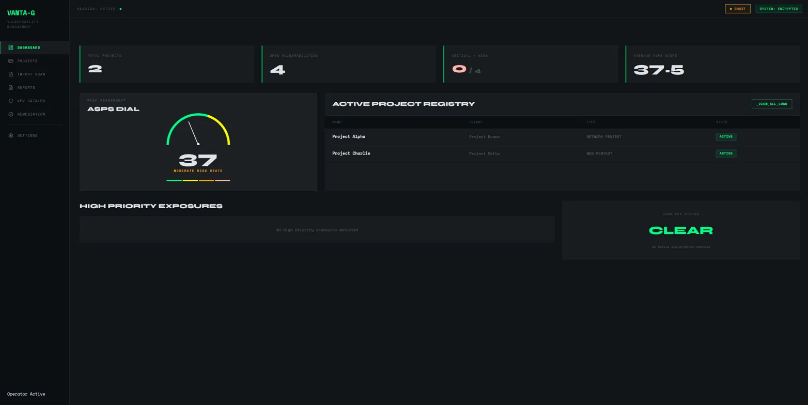
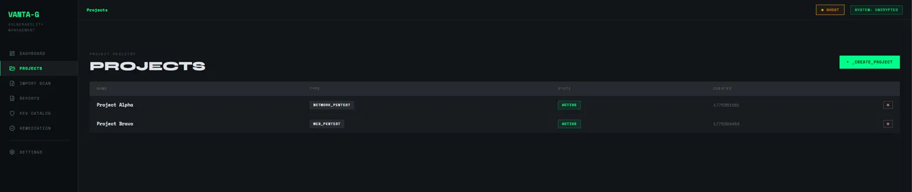
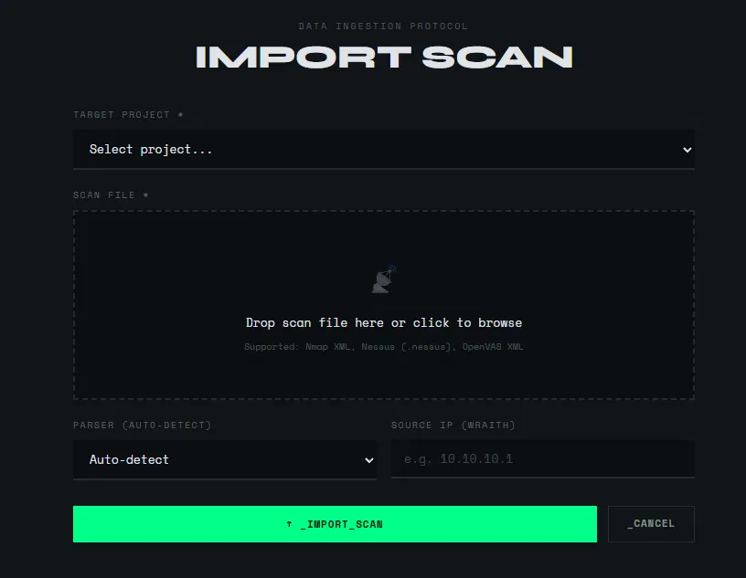
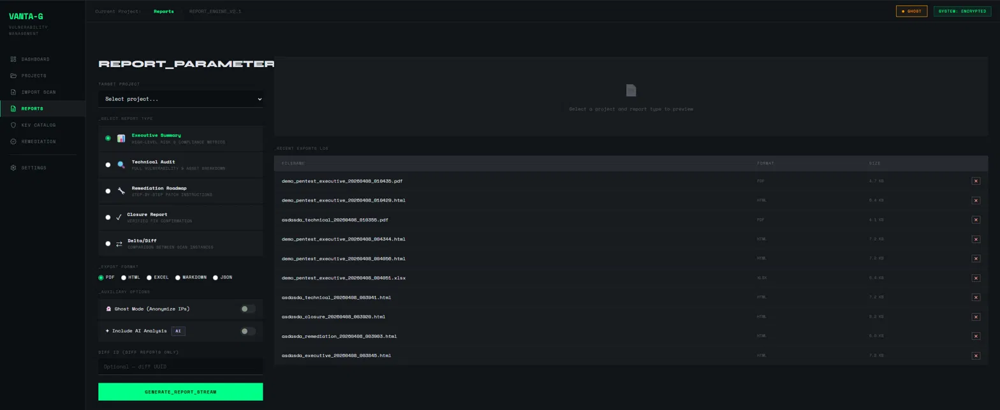
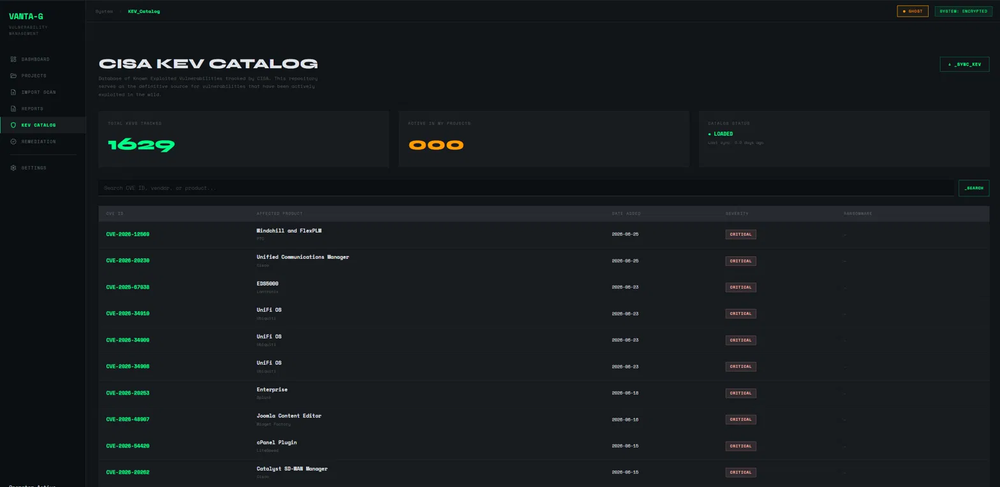
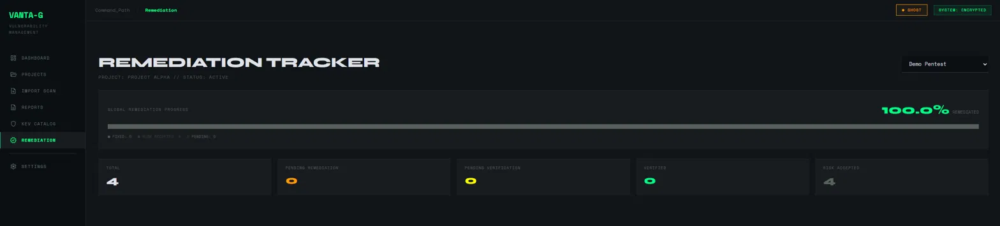
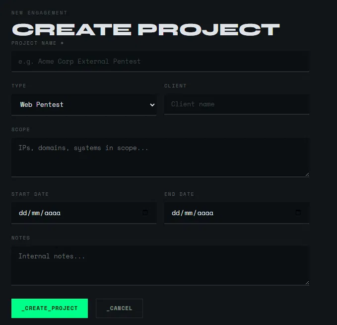
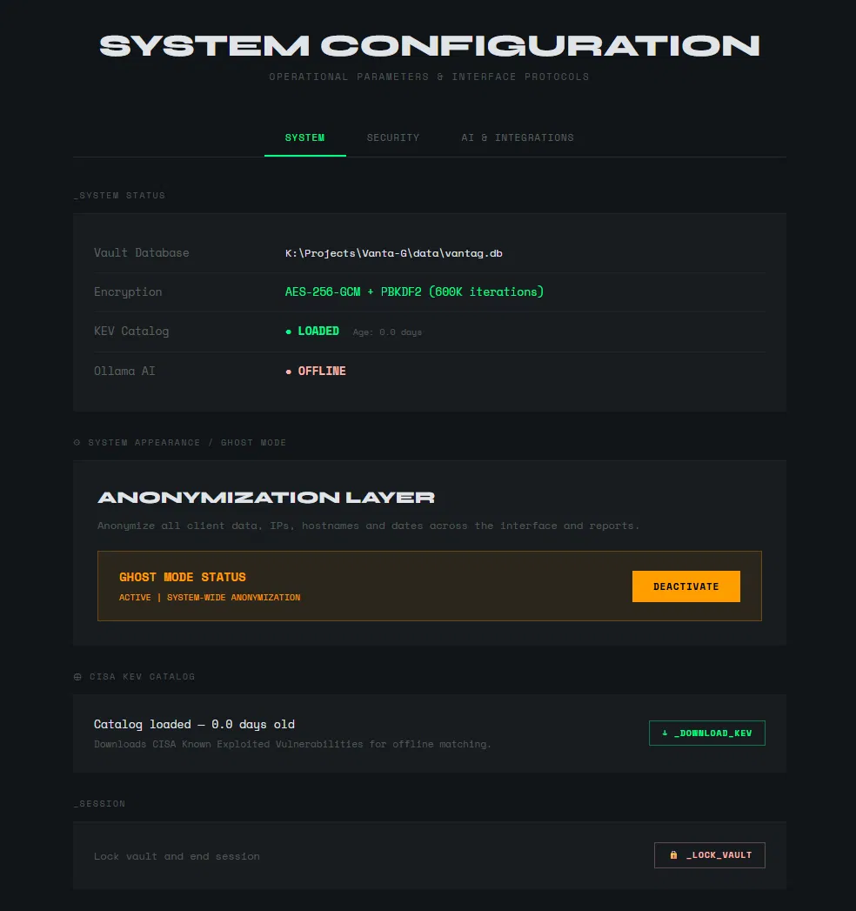
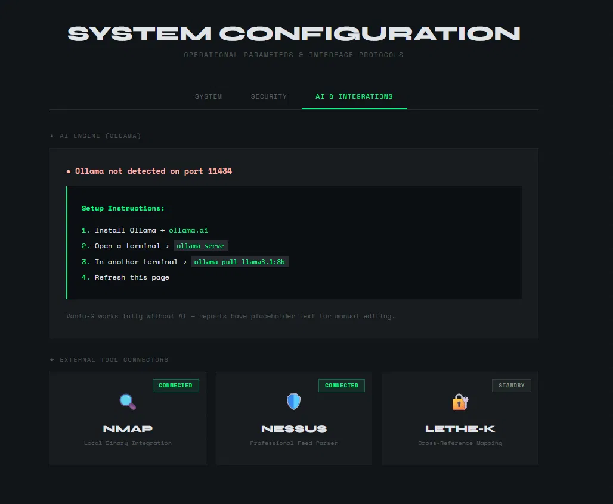
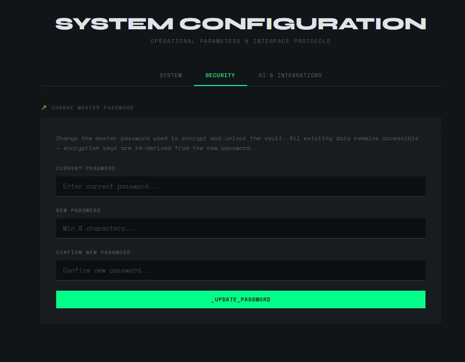

<div align="center">

```
██╗   ██╗ █████╗ ███╗   ██╗████████╗ █████╗       ██████╗
██║   ██║██╔══██╗████╗  ██║╚══██╔══╝██╔══██╗     ██╔════╝
██║   ██║███████║██╔██╗ ██║   ██║   ███████║     ██║  ███╗
╚██╗ ██╔╝██╔══██║██║╚██╗██║   ██║   ██╔══██║     ██║   ██║
 ╚████╔╝ ██║  ██║██║ ╚████║   ██║   ██║  ██║     ╚██████╔╝
  ╚═══╝  ╚═╝  ╚═╝╚═╝  ╚═══╝   ╚═╝   ╚═╝  ╚═╝      ╚═════╝
```

**Vulnerability Management System for Individual Pentesters**


*Local · Encrypted · AI-assisted reporting · Zero external data transmission*

</div>

---

## Overview

Vanta-G is a local vulnerability management platform built for individual pentesters who need more than a spreadsheet but don't want the overhead of enterprise tooling. It covers the full engagement lifecycle: importing scanner output, intelligent prioritization, professional report generation, and post-remediation tracking — all stored locally in an encrypted database, with no data ever leaving the machine.

The core problem it solves is fragmentation. After a pentest, findings live scattered across Nessus exports, Nmap XML files, manual notes, and half-finished report templates. Vanta-G consolidates everything into a single encrypted vault per engagement, produces client-ready reports in multiple formats, and tracks remediation progress across re-scans.

> **Scope:** This repository is a documented showcase. Source code is private.

---

## 📸 Screenshots

<details>
<summary><strong>👉 Click here to view screenshots (10)</strong></summary>

<br>

<table width="100%">
  <!-- FILA 1: IMÁGENES -->
  <tr>
    <td width="50%" align="center"></td>
    <td width="50%" align="center"></td>
  </tr>
  <!-- FILA 1: TEXTOS -->
  <tr>
    <td align="center">
      <kbd>📊 Dashboard</kbd><br>
      <sub>ASPS Dial • Project registry • CISA KEV status</sub>
    </td>
    <td align="center">
      <kbd>📁 Projects</kbd><br>
      <sub>Engagement list with type and status badges</sub>
    </td>
  </tr>

  <!-- FILA 2: IMÁGENES -->
  <tr>
    <td width="50%" align="center"></td>
    <td width="50%" align="center"></td>
  </tr>
  <!-- FILA 2: TEXTOS -->
  <tr>
    <td align="center">
      <kbd>📥 Import Scan</kbd><br>
      <sub>Drag-and-drop ingestion with auto-detect parser</sub>
    </td>
    <td align="center">
      <kbd>📄 Report Engine v2.1</kbd><br>
      <sub>Five report types • Five export formats</sub>
    </td>
  </tr>

  <!-- FILA 3: IMÁGENES -->
  <tr>
    <td width="50%" align="center"></td>
    <td width="50%" align="center"></td>
  </tr>
  <!-- FILA 3: TEXTOS -->
  <tr>
    <td align="center">
      <kbd>🛡️ CISA KEV Catalog</kbd><br>
      <sub>1,629 tracked KEVs with offline sync</sub>
    </td>
    <td align="center">
      <kbd>📈 Remediation Tracker</kbd><br>
      <sub>Per-project progress with status breakdown</sub>
    </td>
  </tr>

  <!-- FILA 4: IMÁGENES -->
  <tr>
    <td width="50%" align="center"></td>
    <td width="50%" align="center"></td>
  </tr>
  <!-- FILA 4: TEXTOS -->
  <tr>
    <td align="center">
      <kbd>✨ Create Project</kbd><br>
      <sub>Engagement setup with type, scope, client and dates</sub>
    </td>
    <td align="center">
      <kbd>⚙️ System Configuration</kbd><br>
      <sub>AES-256-GCM vault • PBKDF2 600k iterations • KEV sync status</sub>
    </td>
  </tr>

  <!-- FILA 5: IMÁGENES -->
  <tr>
    <td width="50%" align="center"></td>
    <td width="50%" align="center"></td>
  </tr>
  <!-- FILA 5: TEXTOS -->
  <tr>
    <td align="center">
      <kbd>🤖 AI & Integrations</kbd><br>
      <sub>Ollama local inference • Nmap • Nessus • Lethe-K connectors</sub>
    </td>
    <td align="center">
      <kbd>🔒 Security Settings</kbd><br>
      <sub>Master password management with full key re-derivation</sub>
    </td>
  </tr>
</table>

</details>

## Screenshots

<table>
  <tr>
    <td></td>
    <td></td>
  </tr>
  <tr>
    <td align="center"><sub>Dashboard — ASPS Dial + project registry + CISA KEV status</sub></td>
    <td align="center"><sub>Projects — engagement list with type and status badges</sub></td>
  </tr>
  <tr>
    <td></td>
    <td></td>
  </tr>
  <tr>
    <td align="center"><sub>Import Scan — drag-and-drop ingestion with auto-detect parser</sub></td>
    <td align="center"><sub>Report Engine v2.1 — five report types, five export formats</sub></td>
  </tr>
  <tr>
    <td></td>
    <td></td>
  </tr>
  <tr>
    <td align="center"><sub>CISA KEV Catalog — 1,629 tracked KEVs with offline sync</sub></td>
    <td align="center"><sub>Remediation Tracker — per-project progress with status breakdown</sub></td>
  </tr>
  <tr>
    <td></td>
    <td></td>
  </tr>
  <tr>
    <td align="center"><sub>Create Project — engagement setup with type, scope, client and dates</sub></td>
    <td align="center"><sub>System Configuration — AES-256-GCM vault · PBKDF2 600k iterations · KEV sync status</sub></td>
  </tr>
  <tr>
    <td></td>
    <td></td>
  </tr>
  <tr>
    <td align="center"><sub>AI & Integrations — Ollama local inference · Nmap · Nessus · Lethe-K connectors</sub></td>
    <td align="center"><sub>Security — master password management with full key re-derivation</sub></td>
  </tr>
</table>

---

## Architecture

Vanta-G is structured in four independent modules that can be used progressively:

```
Vanta-G/
├── modules/
│   ├── ingesta/
│   │   ├── loader.py          # Format detection + import orchestration
│   │   └── diff.py            # Scan comparison — new / persistent / resolved
│   ├── inteligencia/
│   │   ├── engine.py          # ASPS scoring engine + vulnerability lifecycle
│   │   ├── cve.py             # CVE integration + NVD linking
│   │   ├── kev.py             # CISA KEV local query
│   │   └── remediation.py     # Post-remediation tracking and verification
│   ├── reporting/
│   │   ├── generator.py       # Report orchestration by type
│   │   ├── ai_writer.py       # Ollama integration for narrative text
│   │   ├── pdf_gen.py         # PDF export with normative templates
│   │   ├── excel_gen.py       # Excel export
│   │   ├── ghost.py           # Ghost Mode anonymization layer
│   │   └── templates/         # Report templates by type
│   └── operacional/
│       ├── projects.py        # Project + client CRUD
│       └── audit.py           # Operation audit log
├── parsers/
│   ├── nmap.py                # Nmap XML parser
│   ├── nessus.py              # Nessus .nessus parser
│   ├── openvas.py             # OpenVAS XML parser
│   ├── burp.py                # Burp Suite parser
│   └── generic_json.py        # Generic JSON schema
├── core/
│   ├── database.py            # SQLite + AES-256-GCM encryption
│   └── security.py            # Master password, PBKDF2 (600k iterations), sessions
├── ui/
│   └── app.py                 # Flask web interface
└── data/
    ├── vantag.db              # Encrypted vault
    ├── kev/                   # CISA KEV local cache
    └── exports/               # Generated reports
```

---

## ASPS Scoring System

Vanta-G uses ASPS (Adaptive Security Prioritization Score) instead of relying on CVSS alone. CVSS scores generic technical severity — it doesn't account for the actual context of the affected system. ASPS adds that layer.

```
ASPS = Severity × Exposure × Context Factor
```

| Component | Range | Description |
|---|---|---|
| **Severity** | 1–5 | Informational → Critical (RCE / full compromise) |
| **Exposure** | 1–4 | Internal-only → Internet-facing |
| **Context Factor** | Modifier | Critical asset, public exploit, CISA KEV match, compensating control |

**Scale:**

| Score | Label | Action |
|---|---|---|
| 0–10 | INFO | Document, no immediate action |
| 11–30 | LOW | Schedule remediation |
| 31–60 | MEDIUM | Remediate within sprint |
| 61–85 | HIGH | Prioritize this week |
| 86–100 | CRITICAL | Immediate action required |

Any vulnerability matching a CVE in the CISA KEV list is automatically escalated to maximum priority, regardless of other factors. The KEV list is downloaded and queried locally — no external requests during engagements.

Both CVSS and ASPS scores are stored and displayed. CVSS provides industry-standard reference; ASPS drives internal prioritization.

---

## Key Features

### Data Ingestion
- Drag-and-drop import for Nmap XML, Nessus `.nessus`, OpenVAS XML, and Burp Suite exports
- Auto-detection of file format — no manual parser selection required
- Automatic deduplication before storing findings
- Scan diff engine: import a second scan on the same target and Vanta-G automatically classifies each finding as **new**, **persistent**, or **resolved**

### Intelligence Layer
- ASPS calculation on every imported vulnerability
- CVE identification with direct links to the NVD database
- Offline CISA KEV matching — 1,600+ known exploited vulnerabilities, synced locally
- Full vulnerability lifecycle: `New → Confirmed → In Progress → Remediated → Verified → Risk Accepted`
- State change history with timestamp and notes per finding

### Report Engine
Five report types, five export formats:

| Report | Audience | Content |
|---|---|---|
| Executive Summary | CEO, CISO, management | Risk posture in business language, no technical jargon. AI-assisted. |
| Technical Audit | Dev and sysadmin teams | Full findings with reproduction steps, CVEs, ASPS scores, evidence |
| Remediation Roadmap | Patch team | Prioritized fix list with concrete remediation instructions per finding |
| Closure Report | Client — final delivery | Final state of all findings, before/after comparison, verification confirmation |
| Delta/Diff | Client — progress tracking | What was fixed, what persists, what's new between two scans |

Export formats: **PDF** · **HTML** · **Excel** · **Markdown** · **JSON**

Report structure aligns with the sections expected by **NIS2**, **ENS** (Esquema Nacional de Seguridad), and **ISO 27001 Annex A** — not full compliance implementation, but structured so an auditor immediately recognizes and navigates the content.

### Ghost Mode
Toggle in the top bar, active system-wide. Anonymizes all client names, IPs, hostnames, and dates across the interface and in any generated report. Designed for demos and portfolio presentations without exposing real client data. Does not modify the database — presentation-layer only.

### Local AI via Ollama
Ollama integration generates the narrative sections of reports: executive summaries, business impact descriptions, and remediation recommendations in plain language. If Ollama is not running, reports generate normally with those sections left blank for manual editing. No client data is ever sent to an external API.

### Lethe-K Integration
When a pentest finds a compromised credential, that credential is stored in Lethe-K (the companion secrets manager) as an encrypted secret. Vanta-G stores only the internal reference ID — not the credential itself. The vulnerability record links to the secret without ever holding sensitive data outside its own encrypted vault.

---

## Security Design

| Layer | Implementation |
|---|---|
| Database encryption | AES-256-GCM |
| Key derivation | PBKDF2, 600,000 iterations |
| Session management | Master password required on every launch; vault locks on exit |
| No cloud dependencies | All data stored locally; no telemetry, no external sync |
| Audit log | All operations on sensitive data are timestamped and logged |

---

## Tech Stack

| Component | Technology |
|---|---|
| Language | Python 3.11+ |
| Web UI | Flask |
| Database | SQLite + AES-256-GCM (custom encryption layer) |
| PDF generation | WeasyPrint / ReportLab |
| AI integration | Ollama (local inference, optional) |
| Scanner parsers | Nmap XML · Nessus · OpenVAS · Burp Suite |
| Threat intelligence | CISA KEV (offline) · NVD CVE database |
| Platform | Windows + Linux |

---

## Ecosystem

Vanta-G is part of a personal cybersecurity toolkit. It integrates with:

- **[Lethe-K](../Lethe-K)** — secrets manager for pentest credentials. Vanta-G cross-references finding records with Lethe-K secret IDs.
- **[Wraith-Rotator](../Wraith-Rotator)** — ProtonVPN IP rotation tool. Source IP from each scan can be logged as engagement metadata in Vanta-G for traceability.

---

## Development Phases

| Phase | Scope | Status |
|---|---|---|
| 1 — Secure Core | Encrypted database · Master password · Nmap + Nessus parsers · Manual entry | ✅ Complete |
| 2 — Intelligence | ASPS engine · CVE integration · CISA KEV · Vulnerability lifecycle · Scan diff | ✅ Complete |
| 3 — Reporting | Five report types · PDF/Excel/MD/JSON export · Ollama AI · Ghost Mode | ✅ Complete |
| 4 — Web UI | Flask dashboard · ASPS Dial · Project management · Remediation tracker | ✅ Complete |
| 5 — Extended Parsers | OpenVAS · Burp Suite · Generic JSON · Full CLI | ✅ Complete |
| 6 — Future | Kronos-Z orchestrator integration · Additional parser support | 🔵 Planned |

232 tests across all modules.

---

## License

Non-commercial use only. See [LICENSE](LICENSE) for terms.

---

<div align="center">
  <sub>Built by <a href="https://github.com/EnrikeRoe">EnrikeRoe</a> · Part of the Kronos-Z ecosystem</sub>
</div>
